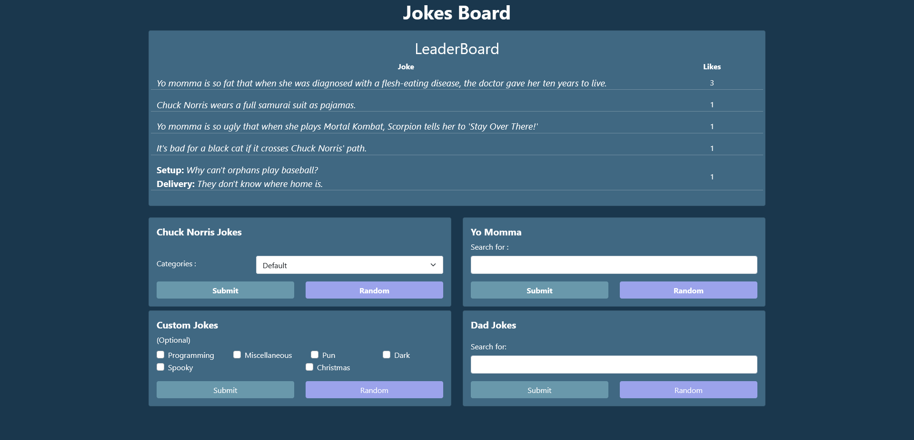

# Objective

Create a Joke board where visitors can find jokes and vote on joke.

## Technology

**API**
- [Chuck Norris](https://api.chucknorris.io/#!)
- [Yo Momma](https://beanboi7.github.io/yomomma-apiv2/)
- [JokeAPI](https://sv443.net/jokeapi/v2/?ref=apilist.fun)
- [icanhazdadjoke](https://icanhazdadjoke.com/api)

**Languages**
- JavaScript
- HTML
- CSS/SASS

**Framework/Library**
- React
- React-bootstrap
- Axios

**Database**
- MongoDB

## Features
- A like option for when you encounter a good/funny joke
- A leaderboard showing the top 5 most like.

